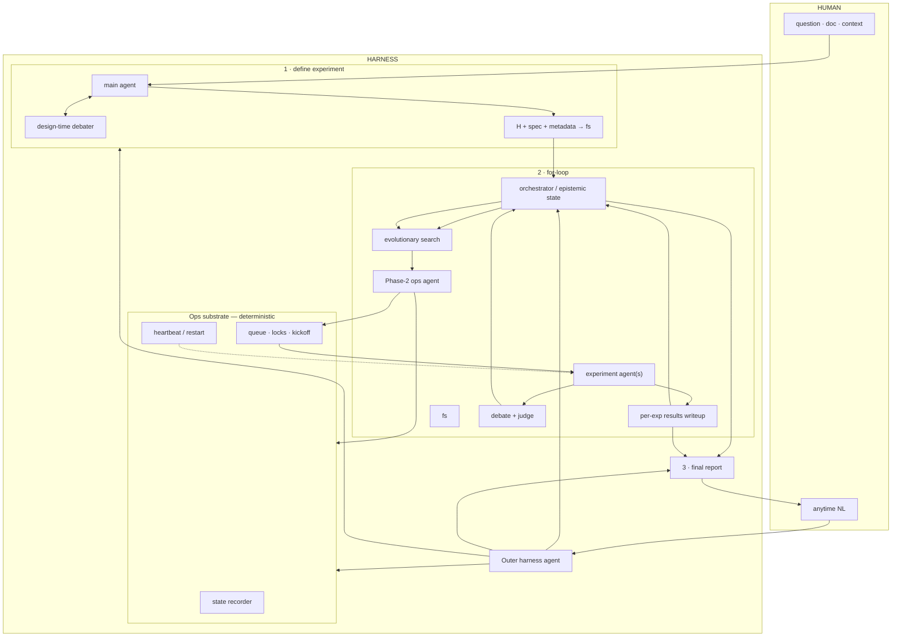

# AI Scientist — Design

**Status:** locked for implementation alignment · 2026-09-19  
**Product:** evolutionary research harness (not “auto-write papers”)  
**Companion:** [`docs/SPEC.md`](./docs/SPEC.md) (implementable contracts) · [`docs/RELATED.md`](./docs/RELATED.md)

**Phenotype:** mutate `hypothesis + experiment_plan` → evaluate → archive  
`{hypothesis, plan, results, metrics}` (+ per-experiment results writeup).

**First example domain:** scalable oversight / debate empirics (pluggable).  
**Non-goals as product definition:** SLT theory search, persona taxonomy search, Sakana-style paper mills.

---

## 0. Locked decisions

| # | Decision |
|---|----------|
| 1 | **Adversarial ×2:** Phase-1 design-time debater **and** Phase-2 debate/judge truth-seeking — both required |
| 2 | **`fs`:** shared filesystem workspace for agents |
| 3 | **Writeup ×2:** per-experiment results writeup → Phase-3 final report |
| 4 | **Harness agents ×2:** Outer (human/global) + Phase-2 ops (fleet soft brain) |
| 5 | **Ops substrate:** heartbeat, state, restart, queue, locks, kickoff = **deterministic code** (not LLM) |
| 6 | **Scheduler** sits after work queue, before workers — not a sibling of writeup under search |
| 7 | **Phase 1** = interactive intake + auto-research + iterative Q&A + design-time debate → H + spec + metadata |
| 8 | **UX:** IDE-primary (Cursor / Claude Code) via skills + MCP |
| 9 | **Cognitive capabilities = skills;** MAP/queue/restart = code |
| 10 | **Aim V1** (daemon substrate). **Lightweight** skill+script = portable twin, not a version ladder |
| 11 | Search mutates primarily **`hypothesis + experiment_plan`** |
| 12 | **Pin / ban / pause** are first-class Outer → substrate actions |

---

## 1. One-paragraph product

Human drops a question, docs, and optional tools/metadata into an IDE chat. **Phase 1** reads and auto-researches, asks only under-determined questions, and uses a design-time debater to raise hypothesis+spec quality; it exits when expectations are clear and artifacts are on `fs`. An **Outer harness agent** routes anytime human input. **Phase 2** uses evolutionary search (MAP + novelty) to propose many `H+plan` jobs; a **Phase-2 ops agent** prioritizes/triages; a **daemon ops substrate** owns state, healthcheck, restart, and resource kickoff; experiment agents produce results writeups; debate/judge adversarially truth-seeks; the orchestrator updates epistemic state. **Phase 3** writes a final report to the declared audience/style. Skills travel to any host (**lightweight** mode); unattended science requires **V1 daemon**.

---

## 2. Big picture

```text
human  ↔  Outer harness agent  ↔  ops substrate APIs  ↔  Phase-2 ops agent
                │                         │                      │
                ▼                         │                      ▼
         Phase1 / report / orch           │              search → queue → workers
                                          │                      │
                                          └──────────────────────┴──► fs / state
```

**Spine:**

```text
(1) intake → H + spec + metadata on fs
(2) search proposes → Phase-2 ops prioritizes → substrate kicks off workers
    → results writeup → truth-seeking → update epistemic → loop
(3) final report
↔ human anytime via Outer
```

**Debate twice:**

1. Phase 1 — shape better hypotheses/specs  
2. Phase 2 — pressure-test claims/results (epistemic hygiene)

Evolutionary search chooses **what** to try. Substrate (+ Phase-2 ops soft priorities) chooses **when/where** it runs.

---

## 3. Two harness agents + ops substrate

| | Outer harness agent | Phase-2 ops agent | Ops substrate |
|--|---------------------|-------------------|---------------|
| Scope | Whole run + human | This loop’s job fleet | Process truth |
| Does | Route NL, global budget/pause, explain status | Prioritize jobs, triage failures, concurrency policy | Heartbeat, restart, locks, kickoff, state |
| Is LLM? | Yes (skill) | Yes (skill) | **No** |

```text
Outer ──intents/queries──► substrate APIs ◄──schedule intents── Phase-2 ops
                              │
                              ├── state recorder
                              ├── healthcheck / restart / resume
                              └── queue · resource locks · kickoff
```

**Why not one god agent:** human chat must not jitter GPU scheduling; fleet ops must not block “what’s in the report?”

**Pattern:** LLM = soft brain; substrate = hands + memory. Shared APIs: `status`, `restart`, `pause`, `enqueue`, `describe`, `set_concurrency`, `pin`, `ban`.

---

## 4. Architecture diagram



---

## 5. Phase 1 — Define experiment

Not a one-shot YAML dump. **Interactive intake + research + scoping** until the agent has a coherent model of scope, direction, expectations, and metadata — and has written **hypothesis + experiment spec + metadata**.

```text
human: Q / docs / requirements / optional tools+metadata
   → main agent: read · web research · draft · ask gaps only
   ↔ design-time debater: attack / improve H+spec
   → exit: artifacts on fs → Phase 2
```

### 5.1 Human may provide up front

Question, docs, extra requirements, optional tools, optional metadata. **No required form** — incomplete intake is normal.

### 5.2 Main agent loop

1. Read drops into `fs` / context  
2. Auto-research (web + allowed sources)  
3. Draft toward full H + experiment spec  
4. Ask iteratively only what is still under-determined  
5. Design-time debate to raise quality  
6. Exit on epistemic completeness (below)

Later phases may still request metadata/tool updates via Outer. Phase-1 metadata is the **initial contract**, not frozen forever.

### 5.3 Metadata dimensions

Infer when confident (state assumptions in artifacts); ask when load-bearing:

| Dimension | Meaning |
|-----------|---------|
| Budget | $ / tokens / compute |
| Time | Deadline or overnight-ok |
| Credentials | **Env/vault refs only** — never secrets in spec files |
| Audience | Self, lab, LW, interviewers, … |
| Style | Rigorous vs casual |
| Topic fidelity | Stuck to brief vs creative / discovery allowed |
| Extensibility | One-shot vs follow-on ready |
| Knowledge sources | Default web vs user sources |
| Tools | Defaults vs user tools (guide setup if needed) |

### 5.4 Questioning policy

Not a fixed questionnaire. Infer from context; ask when the answer changes experiment shape (train vs eval-only, GPU needs, fidelity, etc.).

### 5.5 Exit condition

> Scope, direction, and expectations are clear enough to run Phase 2 without guessing on load-bearing choices — and concrete **hypothesis + experiment spec + metadata** (with stated assumptions) exist on `fs`.

Human “looks good, go” recommended before kicking the fleet.

### 5.6 Phase-1 artifacts

`hypothesis` · `experiment_spec` · `metadata` · `intake_log` · credential/tool **refs** — see SPEC for paths/schemas.

---

## 6. Phase 2 — For-loop

| Piece | Role |
|-------|------|
| Orchestrator | Epistemic state; closes loop after results / truth-seeking |
| Evolutionary search | Mutate/propose `H+plan`; epistemic value + breadth; MAP/novelty archive |
| Work queue | Candidate jobs |
| Phase-2 ops agent | Soft priority / triage / concurrency policy → substrate intents |
| Ops substrate | Kickoff, locks, healthcheck, restart |
| Experiment agents | Run assigned trials on `fs` |
| Results writeup | Short lab note **per finished trial** |
| Debate + judge | Adversarial truth seeking on claims/results |

```text
search ──candidates──► Phase-2 ops ──intents──► substrate ──kickoff──► workers
                                                      │
                                              healthcheck loop
```

---

## 7. Phase 3 — Final report

Aggregate results writeups + archive + epistemic state into a **final report** matching Phase-1 audience/style. Follow-ups via Outer (may re-enter Phase 1 or orch).

---

## 8. MAP + novelty

Inside Phase 2 — **not** the whole product.

| Pressure | Mechanism |
|----------|-----------|
| Breadth / creativity | Novelty archive / diversity |
| Epistemic value | Fitness from domain metrics + truth-seeking outcomes |
| Memory | QD/MAP archive of full elites `{H, plan, results, metrics, writeup}` |

Parent selection = **code**. Mutation text = **`hypothesize` / `plan_experiment` skills**.  
Behavior descriptors should come from **results/probe behavior**, not prompt embeddings (domain pack defines axes).

Default operationalization of “epistemic value” = **domain-pack interface** (metrics + verification gates); global default can be refined once the first domain pack lands.

---

## 9. Skills vs code vs tools

**Skills** = local markdown playbooks (`.cursor/skills/` / `skills/*/SKILL.md`).  
The **host agent** (Cursor / Claude Code) discovers them by `description` and *reads* them
when relevant — same as any other Cursor skill. They are **not** Python string templates
stuffed into `complete(system="Skill: id")`.

**Tools** = callables the agent can invoke:

| Surface | Tools |
|---------|--------|
| IDE | MCP `sci_*` (status, pause, pin, …) |
| Headless `Agent` runtime | same methods + `read_skill` |

**Code** = deterministic substrate (MAP, queue, locks, kickoff, heartbeat).

| Skills (playbooks) | Tools (hands) | Code |
|--------------------|---------------|------|
| `outer_route`, `phase1_intake`, `design_debate` | MCP / Agent control tools | — |
| `hypothesize`, `plan_experiment` | (worker Agent / prompt-pack fallback) | MAP parent select |
| `truth_*`, `results_writeup` | — | domain.run / grade |
| `ops_triage` | `get_queue` / `get_fleet` / … | apply intents to sqlite |
| `final_report` | `sci_report` | archive readers |

Anti-pattern: scheduler-as-markdown-skill; skill-id-as-system-prompt; declaring
`tools: [control_api]` in frontmatter without registering real MCP/Agent tools.

See [`docs/IDE.md`](./docs/IDE.md).

---

## 10. UX — IDE-primary

User lives in **Cursor / Claude Code**. Daemon still runs Phase-2 harness.

### 10.1 Day in the life

1. Chat: drop question + docs → host loads Phase-1 skills → confirm go  
2. Daemon runs fleet; user does other work  
3. Chat anytime: status / pin / pause / “why did 17 fail?” → **Outer = host agent** + MCP  
4. Chat: final report  

### 10.2 Three ways to “change the harness”

| Action | What changes |
|--------|----------------|
| Edit skill / subagent | Cognitive behavior — next turn |
| Edit `scheduler.py` / monitor | Substrate — restart daemon |
| Chat “concurrency 4” | Runtime config via MCP tool — no code change |

### 10.3 Process reality

```text
IDE chat + .cursor/skills  --MCP sci_*-->  sci daemon
                                             ├─ healthcheck
                                             ├─ scheduler / queue / locks
                                             ├─ ops_triage Agent loop
                                             └─ workers → fs
```

`sci ask` is a **headless** Outer (`Agent` + same skill files + same controls) for
scripts/CI — not the primary path.

Chat can die; daemon on a GPU box / tmux can continue. Subagents **cannot** replace
healthcheck (no independent fault domain).

---

## 11. Delivery — V1 + lightweight twin

| Mode | What | Aim |
|------|------|-----|
| **V1** | Library + **daemon** substrate + skills + MCP | **Primary — actual AI scientist** |
| **Lightweight** | Same skills + scripts + `fs`; host agent supervises | Portability across any agent — **not** “v0” |

Rules: README north star = V1; same schemas/`fs`/skill IDs where possible; lightweight has no strong unattended guarantees; no separate “v0.5 cron product.”

**Build slices (engineering, not product versions):** schemas+skills+`fs` → daemon+CLI → MCP → document lightweight twin → thin host sugar.  
_Status 2026-09-19:_ all V1 contract slices shipped, including Outer (`sci ask` / `sci_ask`), Phase-2 ops (`ops_triage` loop), Phase-1 auto-research, and experiment agent. Remaining “thin host sugar” is optional IDE polish, not a V1 blocker.

---

## 12. Example domain (not the architecture)

Oversight-style questions (e.g. weak-judge + strong-debater effectiveness; later training dynamics) are a **domain pack**: task suites, graders, descriptor axes, seed hypotheses.  
They exercise the harness; they do not redefine it. Experiment details stay in the pack / in Phase-1 specs the scientist produces — not hard-wired here.

---

## 13. Success criteria (system)

**Engineering:** daemon healthcheck/restart works; IDE MCP drive; resume after kill; skills load in host and workers; Phase 1→2→3 path completable on a toy domain.

**Scientific (on first domain pack):** non-trivial archive diversity **or** honest negative writeup; at least one elite that beats stated baselines on held-out metrics when the domain defines them; apparent-vs-real checks (held-out / audit) visible in report.

**Non-criteria:** workshop acceptance; “solved scalable oversight”; SLT results.
