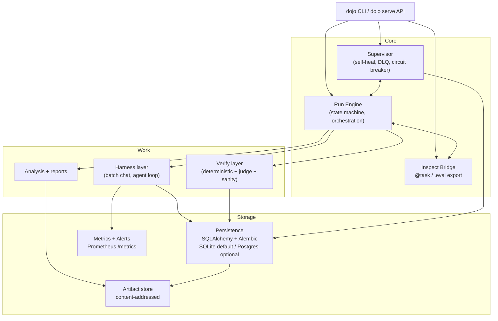

# research-dojo

Production-grade self-research + eval platform for alignment / ML experiments.
SQL is the source of truth; JSONL under `artifacts/<run_id>/audit/` is a
write-through audit export only, never read back as state.

Built to the operability bar of a small eval team (METR / UK AISI /
Resolution-style): a supervisor daemon that resumes crashed runs, Prometheus
metrics, pluggable alerts, dual (deterministic + LLM-judge) verification, and
first-class [Inspect AI](https://inspect.aisi.org.uk/) interop — not a
one-shot notebook script.

## Architecture



## Why not just JSONL?

| | JSONL-only script | research-dojo |
|---|---|---|
| Resume after crash | Re-read whole file, hope no torn writes | DB unique constraint on `(run_id, sample_id, arm, rollout_idx)`; idempotent upsert |
| "What's running right now" | `tail -f` and guess | `dojo status`, DB `status` column, heartbeat staleness |
| Stuck / dead worker | Nobody notices until you check | Supervisor watchdog marks `STALE`, alerts, auto-resumes |
| Metrics over time | Post-hoc `jq` over the file | `metrics` table + Prometheus `/metrics` |
| Failure alerting | None | Rule engine -> webhook/file/log notifiers |
| Cost control | Manual eyeballing | `budget.max_usd` enforced mid-run, `budget_exceeded` alert + auto-stop |
| Debugging one sample | grep the JSONL | `inspect view` transcript viewer |
| Reproducibility | "which version of the script was this?" | Frozen spec + git commit + `dojo bundle export` |

## Quickstart

```bash
cd research_dojo
python3.13 -m venv .venv && source .venv/bin/activate
pip install -e ".[dev]"

dojo db migrate
pytest

dojo run --spec specs/tom_smoke.yaml
dojo status --run-id <run_id>
dojo metrics show <run_id>
```

See `docs/architecture.md` for component detail, `docs/operations.md` for the
ops runbook (stuck runs, DLQ, budget stop, webhook alerts), and
`docs/spec_schema.md` for the experiment spec schema.

## Inspect AI quickstart

```bash
pip install -e ".[inspect]"
dojo inspect run tom_smoke --model azure/gpt-4o-mini
inspect view --log-dir outputs/inspect_logs
```

## CLI surface

```bash
dojo run --spec specs/tom_smoke.yaml [--run-id] [--resume] [--detach]
dojo status [--run-id] [--watch]
dojo cancel <run_id>
dojo resume <run_id>

dojo experiment list|show|compare
dojo diff <run_a> <run_b>
dojo lineage <run_id>
dojo bundle export <run_id> -o bundle.tar.gz

dojo supervisor start|stop|status
dojo dlq list|retry <run_id>
dojo metrics show <run_id>
dojo serve [--port 9090]

dojo inspect run <task> [--model ...]
dojo inspect export <run_id>

dojo alerts test|history

dojo db migrate
dojo db reset  # dev only, --i-understand
```

## Status

v1 (Tier A — operable single node): the seven pillars above, done and
live-validated. Deliberately out of scope for v1, and worth naming rather
than pretending they don't matter: an async job queue for multi-worker
scale, OpenTelemetry traces, container sandboxing for the agent harness, and
golden-run regression CI. Those are the natural "if this had to run a team's
daily evals" next steps.
