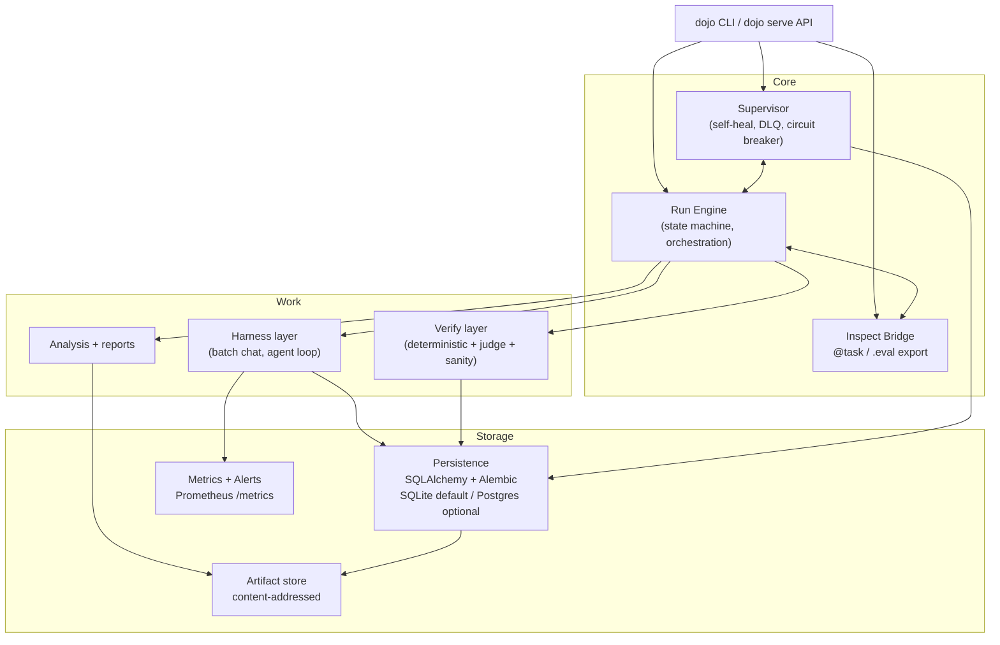
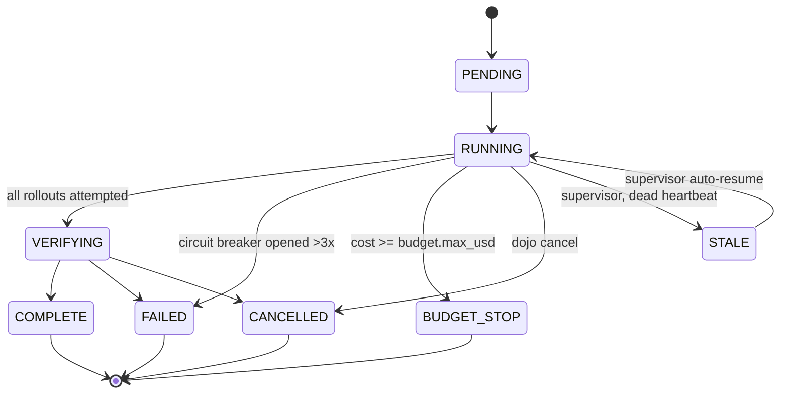

# Architecture

## Source of truth

The `runs`/`rollouts`/`judgments`/`metrics`/... tables (SQLite by default at
`<data_dir>/dojo.db`, optional Postgres via `DOJO_DATABASE_URL`) are the only
state the system trusts. `artifacts/<run_id>/audit/*.jsonl` is a
write-through export for humans/grep — it is **never read back** to
reconstruct state. This is the opposite of the "JSONL + hope no torn writes"
pattern in `app/shortcut_forensics/scripts/controller.py`, which this project
deliberately upgrades on (see README.md's comparison table).

## Run lifecycle

`src/research_dojo/engine/state_machine.py` encodes the legal-transition
graph; `engine/run_engine.py` is the only writer of `runs.status`.

## Module map

| Module | Owns |
|---|---|
| `config/spec.py` | Pydantic `ExperimentSpec` — validated YAML -> frozen JSON, `spec_hash()` |
| `config/settings.py` | Process settings, Azure/OpenAI routing (`docs/AZURE.md` rule) |
| `db/models.py` | SQLAlchemy 2.x ORM models, naming convention for Alembic |
| `db/repositories.py` | **Only** place business logic touches the DB — idempotent upserts, resume queries, circuit-breaker state |
| `db/session.py` | Engine/session factory; enables SQLite WAL + busy_timeout |
| `engine/run_engine.py` | Orchestrates one run: dataset load, work-item enumeration, harness/verify/metrics per rollout, budget + circuit-breaker gates, graceful stop |
| `engine/dataset.py` | JSONL dataset -> `samples` rows |
| `engine/state_machine.py` | Run status transition graph |
| `harness/` | `Harness` protocol; `BatchChatHarness` (one chat call), `AgentHarness` (bounded bash-tool loop) |
| `verify/` | `check_deterministic`, `judge_rollout` (LLM judge, rubric-versioned), `check_sanity` (apparent-progress flags), `Verifier` (combines all three) |
| `metrics/` | `collector.py` writes to the `metrics` table; `exposition.py` renders it as Prometheus text |
| `alerts/` | `rules.py` (pure evaluators) -> `dispatcher.py` (fan-out + persist) -> `notifiers.py` (log/file/webhook) |
| `supervisor/daemon.py` | Poll loop: stale-run detection, auto-resume subprocess launch, DLQ re-enqueue |
| `inspect_tasks/` | `tom_smoke.py` (the `@task`), `bridge.py` (dojo run -> `.eval` export, `.eval` -> dojo import) |
| `artifacts/` | `store.py` (content-addressed writes, audit JSONL), `bundle.py` (reproducibility tarball) |
| `analysis/` | `report.py` (REPORT.md), `lineage.py` (spec_hash -> model -> dataset -> judge summary) |
| `api/server.py` | FastAPI: `/healthz`, `/metrics`, `/api/runs` |
| `cli/main.py` | Typer app — thin wrapper over everything above |

## Why these boundaries

- **Repos, not raw SQL**: every mutation goes through `db/repositories.py`
  so idempotency (rollout upsert) and locking rules (circuit breaker state)
  live in one place, not scattered across the engine.
- **Harness is a protocol, not a base class**: `BatchChatHarness` and
  `AgentHarness` share no implementation inheritance — only the `run(prompt,
  *, sample_id, arm) -> HarnessResult` shape. Adding a third harness kind
  never risks breaking the other two.
- **Verify is three independent, composable checks**: deterministic (cheap,
  always runs), judge (LLM, opt-in via spec), sanity (catches the judge/
  deterministic pipeline itself lying — apparent vs. real progress).
- **Metrics table, not just Prometheus counters in memory**: a fresh
  `dojo serve` process (or a second worker) can render correct `/metrics`
  because the numbers live in SQL, not in a running process's memory.
